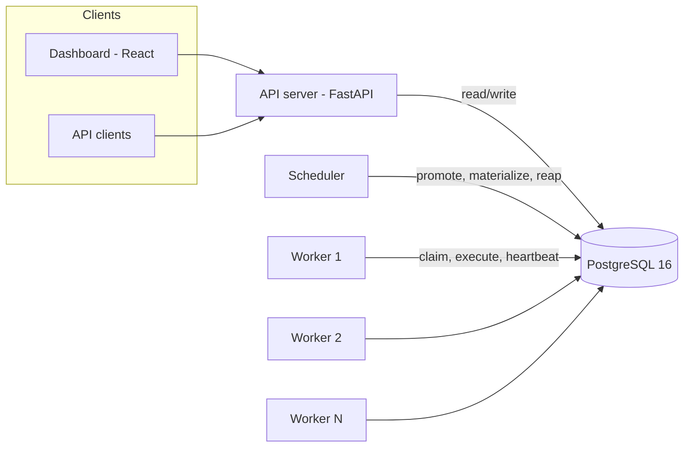
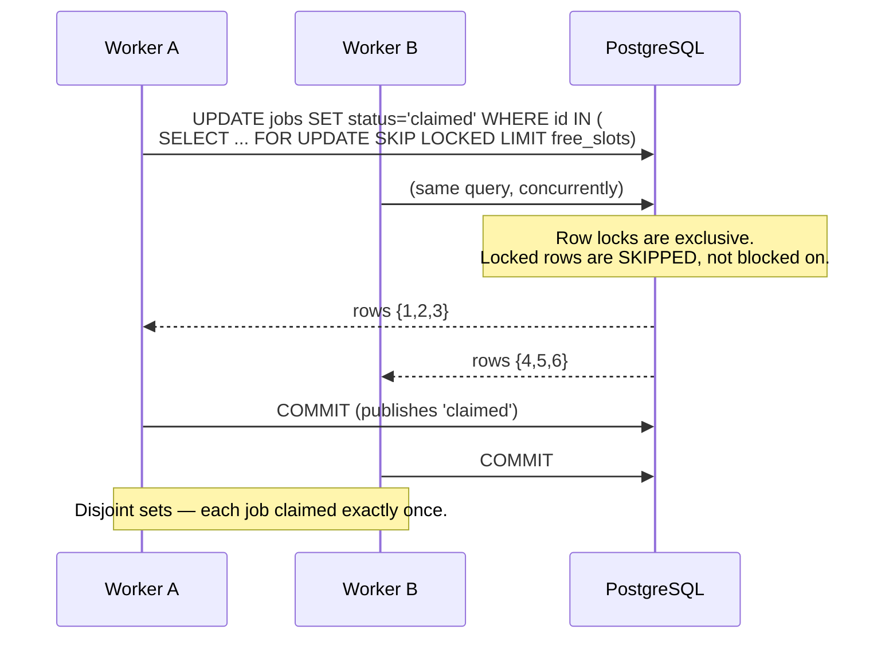
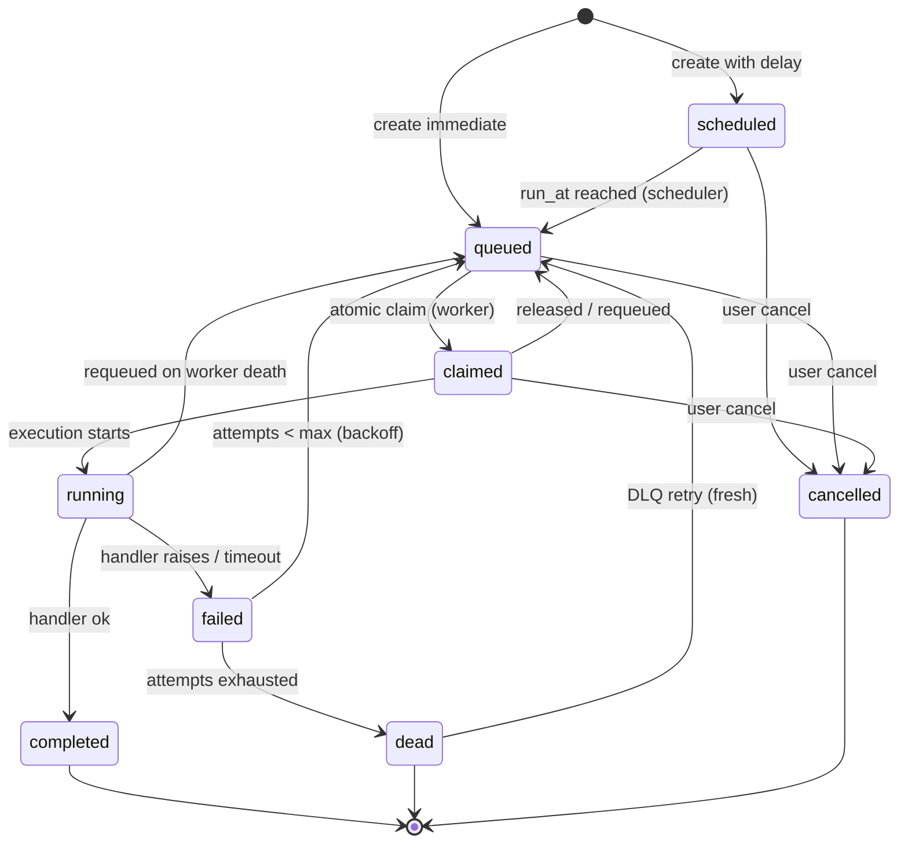
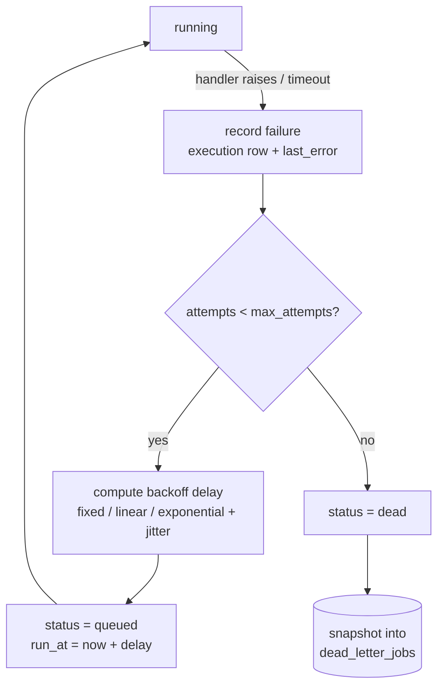
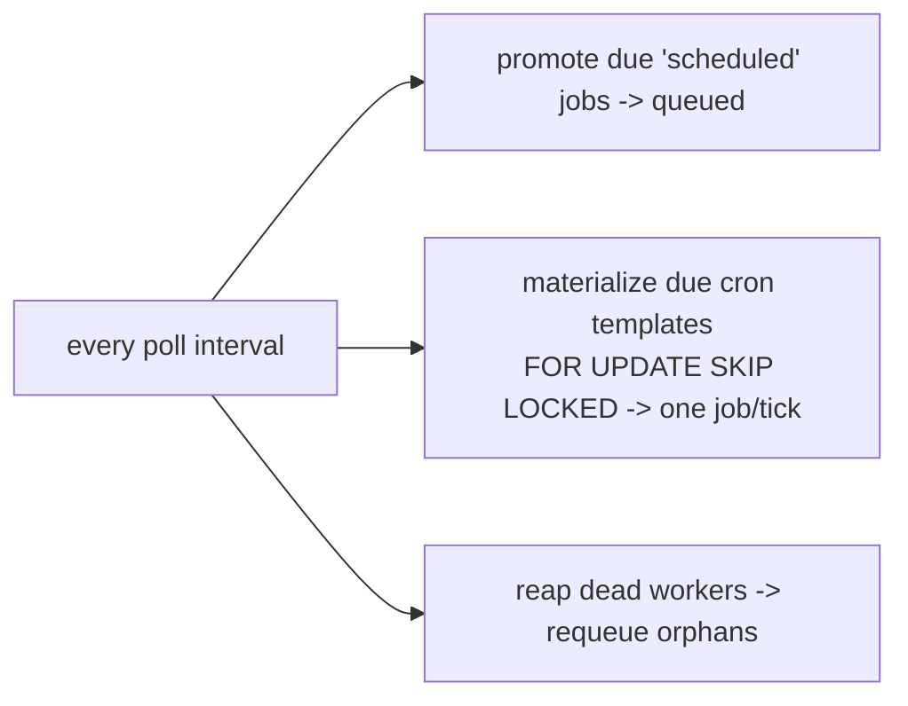

# Architecture

A distributed job scheduler where **PostgreSQL is both the source of truth and the
queue**. There is no separate broker: jobs are claimed atomically with
`SELECT ... FOR UPDATE SKIP LOCKED`. Four processes cooperate through the database.

## Components

- **API server** (`app/`) — REST API for auth, projects, queues, jobs, schedules,
  DLQ, workers, metrics. Stateless; scales horizontally.
- **Scheduler** (`scheduler/`) — one loop that promotes due delayed jobs,
  materializes cron jobs, and runs the dead-worker reaper. Safe to run several
  instances (`SKIP LOCKED` on due rows).
- **Workers** (`worker/`) — claim jobs atomically, execute them concurrently under
  a bounded task pool, heartbeat, and shut down gracefully. Run as many as you like.
- **PostgreSQL** — the queue, the state store, and the metrics source.

## The claim path (no duplicate execution)

The core guarantee: N workers claiming the same queue never get the same job.

Ordering is `priority DESC, run_at ASC, id ASC`, matched by the partial index
`ix_jobs_claim`. Paused queues and queues already at their `concurrency_limit` are
excluded at claim time.

## Job lifecycle

Every status change goes through the single transition function in
`app/services/job_state.py` (validates the transition, stamps timestamps, writes a
`job_logs` row). The claim `UPDATE` is the one sanctioned bulk exception.

## Failure, retry, and dead-lettering

Retries are **scheduled, not slept** — a failed job goes back to `queued` with a
future `run_at`; workers never `sleep()` while holding a job. Each execution attempt
is one `job_executions` row, so metrics (throughput, success rate, p50/p95) derive
entirely from that table.

## Recovery

- **Dead-worker reaper** (in the scheduler): a worker silent past
  `HEARTBEAT_TIMEOUT_S` is marked `dead`; its in-flight (`claimed`/`running`) jobs are
  requeued with an incremented attempt and a `requeued_after_worker_death` log line.
  Dangling `running` execution rows are closed as failed.
- **Graceful shutdown** (in the worker): on SIGINT/SIGTERM the worker stops claiming,
  drains in-flight tasks up to `DRAIN_TIMEOUT_S`, releases anything unfinished back to
  `queued`, and marks itself `stopped`.

Together these give **at-least-once** execution; client-supplied `idempotency_key`
plus idempotent handlers make the end result effectively once. See
[design-decisions.md](design-decisions.md).

## Scheduler responsibilities

Recurring `scheduled_jobs` are **templates** — they never execute directly. Each tick
materializes a fresh `jobs` row and advances `next_run_at` via croniter, guarded by
`FOR UPDATE SKIP LOCKED` so two schedulers produce exactly one job per tick.
