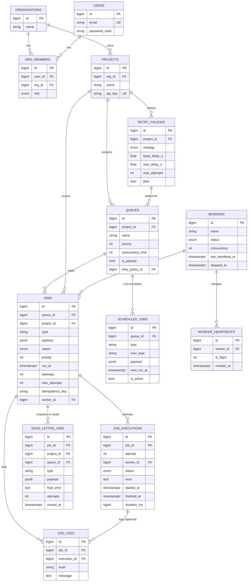

# Entity–Relationship Diagram

13 tables. Multi-tenant identity (`users` / `organizations` / `org_members`) →
`projects` → `queues` → `jobs`, with execution history, cron templates, worker
tracking, and a dead-letter table hanging off `jobs`.

## Cascades & indexes at a glance

- **Cascade delete** flows `projects → queues → jobs → {job_executions, job_logs,
  dead_letter_jobs}`; deleting a project tears down its whole subtree.
- **`SET NULL`** on `jobs.worker_id` and `job_executions.worker_id` — losing a
  worker never deletes job history.
- Hot path index: partial `jobs (queue_id, priority DESC, run_at, id)
  WHERE status = 'queued'`. See [design-decisions.md](design-decisions.md) for the
  full index rationale.
